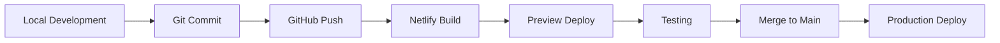

# Local SEO Ranker - Architecture Summary

## 🏗️ System Architecture Overview

Local SEO Ranker is a modern, cloud-native SEO management platform built with scalability, security, and performance in mind.

### Core Architecture

```
┌─────────────────────────────────────────────────────────┐
│                Marketing Website                         │
│              mylocalseoranker.com                       │
│                  (WordPress)                           │
└─────────────────────────────────────────────────────────┘
                              │
                              ▼
┌─────────────────────────────────────────────────────────┐
│                Web Application                          │
│            app.mylocalseoranker.com                     │
│              (React + Netlify)                         │
├─────────────────────────────────────────────────────────┤
│  Frontend: React 18 + TypeScript + Tailwind           │
│  UI: shadcn/ui + Radix UI Components                   │
│  State: React Query + Context API                      │
│  Routing: React Router v6                              │
└─────────────────────────────────────────────────────────┘
                              │
                              ▼
┌─────────────────────────────────────────────────────────┐
│                Backend Services                         │
├──────────────────────���──────────────────────────────────┤
│  API: Netlify Functions (Serverless)                   │
│  Database: Supabase PostgreSQL                         │
│  Auth: Supabase Auth + 2FA (TOTP)                     │
│  Storage: Supabase Storage                             │
│  Real-time: Supabase Realtime                         │
└─────────────────────────────────────────────────────────┘
                              │
                              ▼
┌─────────────────────────────────────────────────────────┐
│              External Integrations                      │
├─────────────────────────────────────────────────────────┤
│  Maps: Google Maps API + Places API                    │
│  Communications: Twilio (SMS + Email)                  │
│  Webhooks: Bidirectional webhook system                │
│  RSS: Feed parsing and content analysis                │
└─────────────────────────────────────────────────────────┘
```

## 🌐 Domain Structure

### Production Domains

- **Marketing Site**: `mylocalseoranker.com`

  - WordPress-based marketing and sales site
  - Product information, pricing, blog
  - Lead generation and conversion

- **Web Application**: `app.mylocalseoranker.com`
  - React SPA hosted on Netlify
  - Main application interface
  - API endpoints via Netlify Functions

### DNS Configuration

```dns
mylocalseoranker.com          A      192.0.2.1
www.mylocalseoranker.com      CNAME  mylocalseoranker.com
app.mylocalseoranker.com      CNAME  netlify-app.netlify.com
```

## 🔧 Technology Stack

### Frontend Technologies

| Component        | Technology      | Version | Purpose             |
| ---------------- | --------------- | ------- | ------------------- |
| Framework        | React           | 18.3.1  | UI Framework        |
| Language         | TypeScript      | 5.5.3   | Type Safety         |
| Build Tool       | Vite            | 6.2.2   | Development & Build |
| Styling          | Tailwind CSS    | 3.4.11  | Utility-first CSS   |
| UI Library       | shadcn/ui       | Latest  | Component Library   |
| State Management | React Query     | 5.56.2  | Server State        |
| Routing          | React Router    | 6.26.2  | Client-side Routing |
| Forms            | React Hook Form | 7.53.0  | Form Management     |
| Validation       | Zod             | 3.23.8  | Schema Validation   |

### Backend Technologies

| Component      | Technology          | Version | Purpose             |
| -------------- | ------------------- | ------- | ------------------- |
| Hosting        | Netlify             | Latest  | Static Site Hosting |
| Functions      | Netlify Functions   | Latest  | Serverless API      |
| Database       | Supabase PostgreSQL | 15+     | Primary Database    |
| Authentication | Supabase Auth       | Latest  | User Authentication |
| Storage        | Supabase Storage    | Latest  | File Storage        |
| Real-time      | Supabase Realtime   | Latest  | Live Updates        |

### External Services

| Service         | Purpose                    | Integration       |
| --------------- | -------------------------- | ----------------- |
| Google Maps API | Location services, mapping | Places, Geocoding |
| Twilio          | SMS & Email communications | REST API          |
| SendGrid        | Email delivery             | SMTP/API          |
| Supabase        | Backend as a Service       | Full integration  |

## 🔐 Security Architecture

### Authentication & Authorization

- **Multi-Factor Authentication**: TOTP-based 2FA
- **Session Management**: JWT tokens with refresh rotation
- **Role-Based Access Control**: Granular permission system
- **Password Security**: BCrypt hashing with salt

### Data Protection

- **Encryption at Rest**: Supabase encryption
- **Encryption in Transit**: TLS 1.3
- **Input Validation**: Comprehensive sanitization
- **API Security**: Rate limiting, CORS, CSP

### Compliance & Monitoring

- **Audit Logging**: Complete activity tracking
- **Real-time Monitoring**: Security event detection
- **Privacy Compliance**: GDPR-ready data handling
- **Incident Response**: Automated alerting system

## 📊 Data Architecture

### Database Design

```sql
-- Core Tables Structure
users                 -- User accounts and profiles
├── businesses        -- Business profiles (1:N)
│   ├── projects      -- SEO projects (1:N)
│   ├── locations     -- Business locations (1:N)
│   ├── reviews       -- Customer reviews (1:N)
│   └── analytics     -- Performance metrics (1:N)
├── communications    -- Messages and campaigns (1:N)
├── webhooks          -- Webhook registrations (1:N)
└── audit_logs        -- Activity tracking (1:N)
```

### Data Flow

1. **User Input** → Client-side validation (Zod)
2. **API Request** → Netlify Functions
3. **Business Logic** → TypeScript/Node.js
4. **Data Persistence** → Supabase PostgreSQL
5. **Real-time Updates** → Supabase Realtime
6. **External Sync** → Third-party APIs

## 🚀 Deployment Pipeline

### Development Workflow



### Environment Configuration

| Environment | Domain                     | Database       | Purpose           |
| ----------- | -------------------------- | -------------- | ----------------- |
| Development | localhost:8080             | Local Supabase | Local development |
| Preview     | deploy-preview.netlify.app | Staging DB     | Feature testing   |
| Production  | app.mylocalseoranker.com   | Production DB  | Live application  |

### Build Process

1. **Type Checking**: TypeScript compilation
2. **Code Quality**: ESLint + Prettier
3. **Testing**: Unit + Integration tests
4. **Building**: Vite optimization
5. **Deployment**: Netlify deployment
6. **Cache Invalidation**: CDN cache clearing

## 📡 API Architecture

### RESTful API Design

- **Base URL**: `https://app.mylocalseoranker.com/api`
- **Authentication**: Bearer token (JWT)
- **Rate Limiting**: Per-user/endpoint limits
- **Versioning**: URL-based versioning

### API Endpoints Structure

```
/api/v1/
├── auth/              # Authentication
├── businesses/        # Business management
├── projects/          # SEO projects
├── reviews/           # Review management
├── analytics/         # Performance data
├── communications/    # Messaging
├── webhooks/          # Webhook management
└── integrations/      # External services
```

### Response Standards

- **Success**: HTTP 200/201 with data payload
- **Client Error**: HTTP 4xx with error details
- **Server Error**: HTTP 5xx with error tracking
- **Rate Limit**: HTTP 429 with retry headers

## 🔗 Integration Architecture

### Google Services Integration

- **Maps API**: Business location services
- **Places API**: Business directory integration
- **My Business API**: GMB profile management

### Twilio Communication Stack

- **SMS API**: Review requests and notifications
- **SendGrid**: Transactional and marketing emails
- **Programmable Voice**: Future phone integrations

### Webhook System

- **Incoming Webhooks**: External service notifications
- **Outgoing Webhooks**: Event-driven integrations
- **Security**: Signature verification
- **Reliability**: Retry logic with exponential backoff

### RSS Feed Processing

- **Feed Discovery**: Automatic feed detection
- **Content Parsing**: Structured data extraction
- **Categorization**: AI-powered content classification
- **Distribution**: Real-time feed updates

## 📈 Performance Architecture

### Frontend Optimization

- **Code Splitting**: Route-based lazy loading
- **Bundle Optimization**: Tree shaking and minification
- **Caching Strategy**: Browser and CDN caching
- **Image Optimization**: WebP format and lazy loading

### Backend Performance

- **Database Optimization**: Indexing and query optimization
- **Function Performance**: Cold start minimization
- **CDN Distribution**: Global content delivery
- **Monitoring**: Real-time performance tracking

### Scalability Considerations

- **Horizontal Scaling**: Serverless auto-scaling
- **Database Scaling**: Read replicas and connection pooling
- **Caching Layers**: Redis for session and data caching
- **Load Balancing**: Automatic traffic distribution

## 🔄 Data Backup & Recovery

### Backup Strategy

- **Database Backups**: Automated daily snapshots
- **File Storage Backups**: Cross-region replication
- **Code Repository**: Multiple git remotes
- **Configuration Backups**: Environment variable versioning

### Disaster Recovery

- **RTO**: 4 hours maximum downtime
- **RPO**: 1 hour maximum data loss
- **Failover**: Automatic DNS failover
- **Recovery Testing**: Monthly recovery drills

## 📞 Support & Maintenance

### Monitoring Stack

- **Application Performance**: Real-time metrics
- **Error Tracking**: Automated error reporting
- **Uptime Monitoring**: Multi-region health checks
- **User Analytics**: Behavioral tracking

### Maintenance Procedures

- **Regular Updates**: Monthly dependency updates
- **Security Patches**: Immediate critical patches
- **Performance Reviews**: Quarterly optimization
- **Capacity Planning**: Growth-based scaling

### Support Channels

- **Technical Documentation**: Comprehensive guides
- **API Documentation**: Interactive API explorer
- **Community Support**: Developer community
- **Enterprise Support**: Dedicated support team

---

**Architecture Version**: 2.0  
**Last Updated**: January 2024  
**Next Review**: Quarterly  
**Maintained By**: Platform Architecture Team
